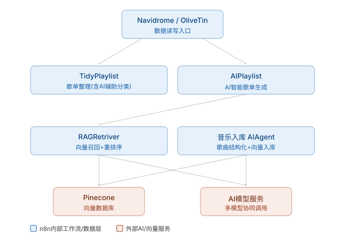

<h1 align="center">🎵 GYMDL</h1>
<p align="center">跨平台智能音乐下载与管理工具</p>

<p align="center">
    <a href="#"></a>
    <a href="#"></a>
    <a href="#"></a>
    <a href="#"></a>
</p>

---

## 🧭 项目简介

**GYMDL** 是一款跨平台智能音乐下载与管理工具，基于 Go开发，支持自动识别主流音乐平台的音乐链接，并实现高效下载、解密与整理。同时提供
CookieCloud 自动同步登录、WebDAV 上传、下载器监控、Telegram Bot 控制与通知等功能，让音乐管理更智能、更便捷。

---

## ✨ 核心特性

| 功能                                                            | 状态      |
| --------------------------------------------------------------- | --------- |
| 主流音乐平台：Apple Music、Spotify、YouTube Music、SoundCloud等 | ✅        |
| 智能链接识别与解析                                              | ✅        |
| CookieCloud 自动同步登录状态                                    | ✅        |
| WebDAV 自动上传整理后的音乐                                     | ✅        |
| Telegram Bot 控制下载、接收通知                                 | ✅        |
| 定时任务调度（gocron）                                          | ✅        |
| 重构模块                                                        | ✅        |
| 下载器监控                                                      | ✅        |
| QQ音乐下载                                                      | ✅        |
| 网易云音乐下载                                                  | ✅        |
| AppleMusic下载                                                  | ✅        |
| YoutubeMusic下载                                                | ✅        |
| Soundcloud下载                                                  | ✅        |
| AI 助手                                                         | ✅        |
| 集成n8n                                                         | ✅        |
| Spotify下载                                                     | ✅        |
| 视频下载                                                        | 🚧 开发中 |
| 多个通知渠道                                                    | ⚠️ 规划中 |
| Web UI                                                          | 🚧 开发中 |

---

## 🕸️ 架构图

### 五层架构

<a href="#"></a>

### n8n架构

<a href="#"></a>


## 🖥️ Web UI

内置 Web UI（开发中），提供以下功能：

- **仪表盘**：各服务在线状态总览
- **下载**：粘贴链接提交下载，实时查看任务进度
- **历史**：查看已完成/失败的下载记录（持久化到 data/web_state/）
- **文件库**：浏览整理后的音乐文件，支持试听/删除
- **设置**：配置概览 + CookieCloud 手动同步
- **日志**：实时 SSE 日志流，支持级别过滤 / 暂停 / 搜索
- **QQ 登录**：浏览器内扫码登录 QQ 音乐，无需 Bot

启用方式：`config.yaml` 中设置 `web_config.enable: true`，访问 `http://localhost:8080`。

开发模式：
```bash
# 终端 1: 启动后端
go run main.go -c config.yaml

# 终端 2: 启动前端（Vite 会将 /api 代理到 8080）
cd webui && npm run dev
```

---

## ⚙️ 快速开始

### 1️⃣ 获取项目并编译

```bash
git clone https://github.com/nichuanfang/gymdl.git .
make release
```

### 2️⃣ 配置文件 `config.yaml` 示例

<details>
<summary>点击展开 YAML 配置示例</summary>

```yaml
# GYMDL 配置文件
# 以下为详细配置项说明

# Web 服务配置
web_config:
  enable: false # 是否启用 web 服务
  app_domain: 'localhost' # web 服务域名
  https: false # 是否开启 HTTPS
  app_port: 8080 # web 服务监听端口
  gin_mode: 'debug' # Gin 运行模式: 可选 [debug, release, test]
  auth: # WebUI 管理登录；密码在配置文件中为明文，请限制文件权限
    enable: false # 是否启用 WebUI 登录门禁
    username: '' # 管理员用户名
    password: '' # 管理员密码；也可通过环境变量覆盖

# CookieCloud 配置
cookie_cloud:
  mode: 1 # cookiecloud同步模式: 1定时刷新 2webhook 默认为1 当同步模式为2时必须启用Gin Web服务
  cookiecloud_url: '' # CookieCloud 服务地址
  cookiecloud_uuid: '' # CookieCloud UUID
  cookiecloud_key: '' # CookieCloud key (多个同步端需填写同一个key，否则会解密失败)
  cookie_file_path: '' # Cookie 文件存储目录
  cookie_file: '' # Cookie 文件名
  expire_time: 180 # Cookie 文件过期时间(分钟)

# 资源整理配置
tidy:
  mode: 1 # 资源整理模式: 1=整理到 dist_dir, 2=整理到 webdav_dir
  dist_dir: 'data/dist' # 当 mode=1 时使用的本地整理目录

# WebDAV 配置
webdav:
  webdav_url: '' # WebDAV 服务地址
  webdav_user: '' # WebDAV 用户名
  webdav_pass: '' # WebDAV 密码
  webdav_dir: '' # WebDAV 目标路径
  webdav_host: '' # webdav主机名 需要容器名+frp访问才需要设置

# 日志配置
log:
  mode: 1 # 日志模式: 1=标准输出, 2=日志文件, 3=标准输出+文件
  level: 2 # 日志等级: 1=debug, 2=info, 3=warn, 4=error, 5=fatal
  file: 'data/logs/run.log' # 日志文件路径

# Telegram 配置
telegram:
  enable: true # 是否启用 Telegram 通知服务
  mode: 1 # 运行模式: 1=长轮询, 2=Webhook (推荐开发用1, 生产用2)
  chat_id: '' # 机器人 chat_id
  bot_token: '' # Telegram Bot Token
  allowed_users:
    - '' # 用户白名单列表 (Telegram 用户 ID)
  webhook_url: '' # Webhook 地址 (mode=2 时必填)
  webhook_port: 9000 # Webhook 模式下监听端口

# lrcapi 配置
lrc_api:
  enable: false # 是否启用lrcapi歌词服务
  lrc_api_url: '' # lrcapi服务url
  api_key: '' # 认证key
  lrc_api_host: '' # lrcapi服务主机名 需要容器名+frp访问才需要设置

# AI 配置
ai:
  enable: false # 是否启用 AI 功能
  base_url: '' # AI 接口的 Base URL
  model: '' # 使用的 AI 模型名称
  api_key: '' # AI 服务的 API Key
  system_prompt: '' # 默认系统提示词

# N8N配置
n8n_config:
  enable: # 是否启用n8n
  n8n_base_url: # 自建n8n的地址
  auth_token: # 端点认证密钥
  empty_trash_endpoint: # 清空回收站
  ai_playlist_endpoint: # AI智能歌单
  tidy_playlist_endpoint: # 歌单整理端点
  playlist_assist: # 是否开启歌单分类AI增强 开启后ai会辅助歌单分类
  tidy_playlist: #歌单,名称必须与navidrome中保持一致
    - name: 中文
      desc: 歌曲的主要演唱语言为中文(含普通话、粤语、闽南语等)
    - name: 英文
      desc: 歌曲的主要演唱语言为英文(若仅有少量英文采样且本质为纯音乐，请勿勾选此项)

# qq音乐api配置
qq_music_api:
  enable: false #是否启用
  endpoint: '' #服务地址 如果需要proxy_url代理 必须填公网地址 否则无法访问
  proxy_url: #代理地址 国外服务器需要配置以绕过地区限制
  vip_level: vip #qq会员级别,可选vip或者svip,影响音质
  login_type: 0 #登录方式: 0未登录 1微信 2QQ
  refresh_key: #用于刷新已失效的musickey musickey1小时会过期
  refresh_token: #用于刷新已失效的musickey musickey1小时会过期
  access_token: #用于刷新已失效的musickey musickey1小时会过期
  music_id: #用于刷新已失效的musickey musickey1小时会过期
  str_music_id: #用于刷新已失效的musickey
  open_id: #用于刷新已失效的musickey musickey1小时会过期
  union_id: #用于刷新已失效的musickey musickey1小时会过期
  music_key: #用于刷新已失效的musickey musickey1小时会过期
  expired_at: #用于刷新已失效的musickey musickey1小时会过期

# 附加配置
additional_config:
  enable_cron: false # 是否启用定时任务功能 只有开启此配置才会尝试同步cookie文件(重要)
  enable_monitor: false # 是否启用目录监听 开启后监听下载目录使用um cli自动解密
  monitor_dirs:
    - '' # 监听的目录,下载器监控
  music_mode: true # 是否启用音乐模式 视频平台链接优先转为音频

# 代理配置
proxy:
  enable: false # 是否启用代理
  scheme: '' # 代理协议: http/https/socks5
  host: '127.0.0.1' # 代理主机
  port: 10809 # 代理端口
  user: '' # 代理用户名
  pass: '' # 代理密码
  auth: false # 是否启用代理认证
```

</details>

> ℹ️ **提示**：展开查看每个字段的详细注释说明，方便初学者直接修改配置。

---

### 3️⃣ 运行 GYMDL

```bash
git clone https://github.com/nichuanfang/gymdl.git .
go mod tidy
go run main.go
```

or

```bash
./gymdl -c config.yaml
```

> [!TIP]
> 推荐的三种运行模式
>
> 1. vps运行,telegram接收用户消息,通过webdav整理入库
> 2. nas运行,telegram接收用户消息,直接整理到nas目录
> 3. win/mac运行,通过下载器监控解锁客户端应用,整理入库

---

### 4️⃣ 使用流程

1. 安装 [CookieCloud 插件](https://chrome.google.com/webstore/detail/cookiecloud/ffjiejobkoibkjlhjnlgmcnnigeelbdl)
2. 登录音乐平台并同步 Cookie(需会员)
3. 配置 `config.yaml`
4. 配置好必要的运行环境
5. 使用 `gymdl`

> ⚡ **小贴士**：确保你的 Cookie 有效，否则下载高音质音乐可能失败。

---

### 5️⃣ 高音质下载前置条件

| 条件                 | 说明     |
| -------------------- | -------- |
| 科学上网             | ✅       |
| 登录音乐平台会员账号 | ✅       |
| CookieCloud 已同步   | ✅       |
| 部署方式             | 详见下表 |

| 部署方式       | 说明                                                                                             |
| -------------- | ------------------------------------------------------------------------------------------------ |
| 🐳 Docker 部署 | <br>• 配置 `config.yaml`<br>                                                                     |
| 💻 本地部署    | 需额外安装：<br>• `Python(3.12+)`<br>• `ffmpeg` / `ffprobe`<br>• `N_m3u8DL-RE`<br>• `MP4Box`<br> |

---

## 🤝 贡献指南

❤️ 欢迎提交 **Issue** 或 **Pull Request**
• 保持代码风格一致
• PR 前使用 `go fmt` 格式化代码
• PR 中详细说明改动内容

---

## 📜 许可证

MIT License ([LICENSE](LICENSE))

---

## 📬 联系方式

- GitHub：[@nichuanfang](https://github.com/nichuanfang)
- Email：[f18326186224@gmail.com](mailto:f18326186224@gmail.com)

> 💬 _“愿你的音乐，永不停歇。”_ 🎧

---

## WebUI 管理登录

WebUI 默认保持兼容模式，不要求登录。需要通过局域网或公网访问时，可在 `config.yaml` 的 `web_config.auth` 中启用并设置管理员凭据：

```yaml
web_config:
  auth:
    enable: true
    username: 'admin'
    password: '替换为强密码'
```

配置内密码以明文保存，请将 `config.yaml` 权限限制为仅运行用户可读写（例如 `chmod 600 config.yaml`），不要提交真实密码到仓库。也可继续使用 `GYMDL_WEBUI_AUTH_ENABLED`、`GYMDL_WEBUI_USERNAME` 和 `GYMDL_WEBUI_PASSWORD` 环境变量；非空环境变量会覆盖配置文件中的对应值，适合通过部署环境安全注入秘密变量。启用后，WebUI 的配置、搜索、任务、日志和文件接口均需要登录；会话有效期为 12 小时。反向代理部署请使用 HTTPS。启用认证但最终没有有效用户名或密码时，GYMDL 会拒绝启动 Web 服务。

设置页面支持编辑并保存 `config.yaml`。保存后页面会标明热加载字段和需要重启的字段；密钥值不会回显，留空保持原值，需清除时使用字段旁的“清除”操作。QQ 扫码成功后的当前凭证保存在运行时 `data/temp/musickey.json` 中；`config.yaml` 的 QQ 凭证只作为该缓存首次初始化/续期时的回退来源，不会随每次登录或续期被改写。WebUI 不会展示原始凭证。

目前支持热加载的设置只有 `tidy.dist_dir` 和 `additional_config.music_mode`，并应用于保存后的新下载/整理任务；运行中的任务保留启动时快照。其他配置保存后需要重启服务。

搜索页支持 10/20/50/100 条合并分页，可通过“上一页 / 下一页”切换结果页；更换关键词或平台组合后从第一页重新搜索。用户点击下载时才进行重复预检，按歌名、歌手、专辑、字节大小和格式五项精确匹配；五项完全匹配会提示重复；为兼容旧版嵌入封面导致的文件字节变化，歌名、歌手、专辑、格式相同且大小接近的旧文件会作为“疑似重复”询问确认。新整理的歌曲会在音频标签保存原始音源大小，后续可精确匹配。网易云与 QQ 音乐会复用短时缓存的目标音质元数据，歌单等多曲链接不逐曲弹出确认。WebDAV 文件库可在当前目录子树按歌曲名、歌手或专辑搜索，并按更新时间从新到旧显示。

Docker 镜像构建会先编译 WebUI，再将前端资源嵌入 Go 程序；Compose 示例挂载的配置文件为 `config.yaml`。当前发布镜像目标为 `linux/amd64`，ARM 主机通过 Compose 示例中的 `platform: linux/amd64` 使用模拟运行。


Docker Compose 示例启用了 WebUI 的容器重启按钮（`GYMDL_WEBUI_RESTART_ENABLED=true`）并配置了 `restart: always`。按钮只在容器中显现；有下载任务时会拒绝重启。自定义 Docker 部署需同时设置该环境变量和容器重启策略。当前发布镜像面向 `linux/amd64`。
